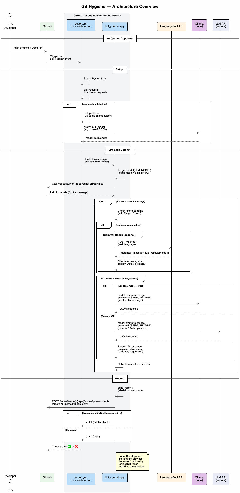

# Git Hygiene

A GitHub Action that lints git commit messages on pull requests for:

- **Structure quality** -- via an LLM (checks that commits explain *why*, not just *what*)
- **Grammar issues** (optional, disabled by default) -- via the [LanguageTool](https://languagetool.org/) API

LLM interaction is powered by the [llm](https://llm.datasette.io/) library,
which supports Ollama (via [llm-ollama](https://github.com/taketwo/llm-ollama)),
OpenAI, and [many other providers](https://llm.datasette.io/en/stable/plugins/directory.html)
through plugins.

When issues are found the action **posts a PR comment** summarising them and **fails the check**.

## Quick Start

### Option A: Local model -- no API key needed (recommended)

Run a small LLM directly on the GitHub Actions runner via
[Ollama](https://ollama.com/). Zero cost, fully private -- no data ever
leaves the runner.

```yaml
name: Git Hygiene

on:
  pull_request:
    types: [opened, synchronize, reopened]

permissions:
  contents: read
  pull-requests: write

jobs:
  lint-commits:
    runs-on: ubuntu-latest
    steps:
      - uses: actions/checkout@v4
      - uses: shortcut/git-hygiene@main
        with:
          github-token: ${{ secrets.GITHUB_TOKEN }}
          use-local-model: "true"
          llm-model: "qwen2.5:0.5b"
```

The action installs [Ollama](https://ollama.com/) via
[setup-ollama](https://github.com/ai-action/setup-ollama), pulls the model,
and uses the [llm](https://llm.datasette.io/) library with the
[llm-ollama](https://github.com/taketwo/llm-ollama) plugin. Works on
`ubuntu-latest`, `macos-latest`, and `windows-latest` runners.

### Option B: Remote API model

Uses a cloud LLM provider -- faster, but requires an API key secret.
The [llm](https://llm.datasette.io/) library has built-in support for OpenAI models.

```yaml
jobs:
  lint-commits:
    runs-on: ubuntu-latest
    steps:
      - uses: actions/checkout@v4
      - uses: shortcut/git-hygiene@main
        with:
          github-token: ${{ secrets.GITHUB_TOKEN }}
          use-local-model: "false"
          llm-model: "gpt-4o-mini"
          llm-api-key: ${{ secrets.OPENAI_API_KEY }}
```

## Inputs

| Input                   | Required | Default                              | Description                                                             |
| ----------------------- | -------- | ------------------------------------ | ----------------------------------------------------------------------- |
| `github-token`          | yes      | `${{ github.token }}`                | GitHub token (needs `pull-requests: write` for comments)                |
| `use-local-model`       | no       | `true`                               | Run the LLM locally via Ollama (no API key needed)                     |
| `llm-model`             | no       | `qwen2.5:0.5b`                       | Model name as known to the `llm` library (run `llm models` to list)   |
| `llm-api-key`           | no       | --                                    | API key for a remote LLM provider (required when `use-local-model` is false) |
| `enable-grammar`        | no       | `false`                              | Enable the LanguageTool grammar checker                                |
| `languagetool-url`      | no       | `https://api.languagetool.org/v2`    | LanguageTool API base URL (point to self-hosted if desired)             |
| `languagetool-language` | no       | `en-US`                              | Language code for grammar checking                                     |
| `ignore-patterns`       | no       | `^Merge\s` / `^Revert\s`            | Newline-separated regexes -- matching commit subjects are skipped      |
| `custom-words`          | no       | --                                    | Newline-separated words to add to the spell-check dictionary           |
| `fail-on-error`         | no       | `true`                               | Set to `false` to post a comment without failing the check             |

### Custom Dictionary

LanguageTool may flag technical terms, tool names, or project-specific words as
spelling mistakes. Git Hygiene ships with a built-in dictionary of ~100 common
dev terms (e.g. Ollama, Kubernetes, GraphQL, pytest, middleware, etc.) that are
automatically suppressed.

To add your own words, use the `custom-words` input:

```yaml
- uses: shortcut/git-hygiene@main
  with:
    github-token: ${{ secrets.GITHUB_TOKEN }}
    custom-words: |
      Shortcut
      Clubhouse
      MyCompanyTool
```

For the local CLI, use `--custom-word` (repeatable):

```bash
python lint_local.py --custom-word Shortcut --custom-word Clubhouse
```

### Ollama Models

Any model from the [Ollama library](https://ollama.com/library) works. Recommended for CI:

| Model | Size | Notes |
|---|---|---|
| `qwen2.5:0.5b` | 397 MB | **Best for CI** -- smallest, fastest |
| `tinyllama` | 637 MB | Good quality for its size |
| `phi3:mini` | 2.3 GB | Better quality, needs more RAM |
| `llama3.2` | 2.0 GB | Strong general-purpose model |

## How It Works



<details>
<summary>Diagram source (PlantUML)</summary>

The diagram above is generated from [`docs/architecture.puml`](docs/architecture.puml).
Regenerate it with:

```bash
plantuml -tpng docs/architecture.puml -o ../docs/
```
</details>

### Step by step:

1. A developer opens or updates a pull request.
2. GitHub triggers the composite action (`action.yml`) on the runner.
3. The action sets up Python, installs `llm`, `llm-ollama`, and `requests`, and (if `use-local-model` is enabled) installs Ollama and pulls the model.
4. `lint_commits.py` fetches all PR commits via the GitHub API.
5. For each commit (skipping those matching ignore patterns):
   - **Grammar check** (if enabled) -- sends the message to the LanguageTool API and collects spelling/grammar matches.
   - **Structure check** -- sends the commit message to the LLM via `model.prompt(message, system=SYSTEM_PROMPT)` using the `llm` library. The system prompt instructs the model to evaluate whether the commit explains *why* the change was made.
6. Results are aggregated into a Markdown report.
7. The report is posted (or updated) as a PR comment.
8. The action exits with code 1 (failing the check) if any issues were found and `fail-on-error` is true.

## Using a Remote LLM Provider

The `llm` library has built-in support for OpenAI. For other providers, install
the appropriate [llm plugin](https://llm.datasette.io/en/stable/plugins/directory.html).

**OpenAI:**
```yaml
- uses: shortcut/git-hygiene@main
  with:
    use-local-model: "false"
    llm-model: "gpt-4o-mini"
    llm-api-key: ${{ secrets.OPENAI_API_KEY }}
```

## Self-Hosted LanguageTool

Run LanguageTool on your own infrastructure and point the action at it:

```yaml
languagetool-url: "https://lt.internal.example.com/v2"
```

## Local Development

You can run git-hygiene locally against your current git repo using Ollama --
no API keys required.

### Setup

```bash
# Install Ollama (macOS)
brew install ollama

# Start the Ollama server
ollama serve

# Pull a model
ollama pull qwen2.5:0.5b

# Install Python dependencies
pipenv install
# or: pip install requests llm llm-ollama
```

### Run

```bash
# Lint the last 5 commits
python lint_local.py

# Lint commits on a branch compared to main
python lint_local.py --range main..HEAD

# Lint the last 10 commits
python lint_local.py --last 10

# Use a specific model
python lint_local.py --model tinyllama

# Use an OpenAI model (built-in to llm, no plugin needed)
python lint_local.py --model gpt-4o-mini --api-key sk-...

# Enable grammar checking too
python lint_local.py --enable-grammar

# Only grammar check (no LLM)
python lint_local.py --grammar-only

# Only structure check (no LanguageTool) -- the default
python lint_local.py --structure-only
```

### CLI Options

| Flag | Description |
|---|---|
| `--range REV_RANGE` | Git revision range (e.g. `main..HEAD`) |
| `--last N` | Number of recent commits to lint (default: 5) |
| `--model MODEL` | Model name as known to `llm` (default: `qwen2.5:0.5b`). Run `llm models` to list. |
| `--api-key KEY` | API key for remote providers |
| `--enable-grammar` | Enable the LanguageTool grammar checker (disabled by default) |
| `--grammar-only` | Only run the grammar check (implies `--enable-grammar`) |
| `--structure-only` | Only run the LLM structure check |
| `--languagetool-url URL` | Custom LanguageTool API URL |
| `--language CODE` | Language for grammar checking (default: `en-US`) |
| `--ignore-pattern REGEX` | Regex for subjects to skip (repeatable) |
| `--custom-word WORD` | Extra words for the spell-check dictionary (repeatable) |

## Development

```bash
# Install dependencies
pipenv install --dev
# or: pip install requests llm llm-ollama pytest

# Run unit tests (mocked, fast)
pipenv run pytest tests/ -v

# Run integration tests with a real local Ollama model
# (requires: ollama serve + ollama pull qwen2.5:0.5b)
pipenv run pytest tests/test_integration_ollama.py -v --run-ollama

# Use a specific model for integration tests
OLLAMA_MODEL=tinyllama pipenv run pytest tests/test_integration_ollama.py -v --run-ollama
```

## License

MIT
